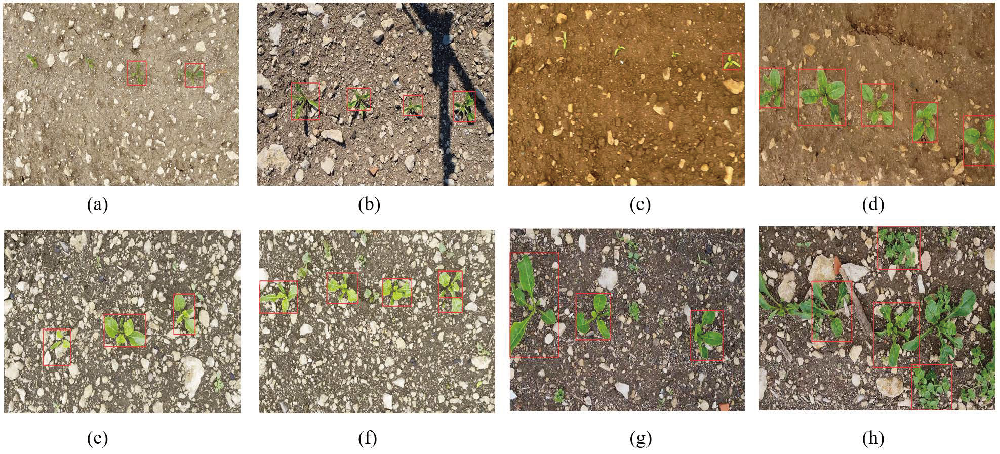

# DT/MARS-CycleGAN
The repository is for the paper: DT/MARS-CycleGAN: Improved Object Detection for MARS Phenotyping Robot, including the code and dataset for reproducing. 

The paper is published on [Arxiv](https://arxiv.org/abs/2310.12787) , and under review on Journal of field robotics.

## Pipeline of DT/MARS-CycleGAN

Fig. 1: Illustration of the physical/DT robots (left panel), the DT/MARS-CycleGAN model (middle panel), and the crop object/row detection network (right panel).


<p align="center">
  
</p>
<p align="center"><i>Fig. 2: Simulation-to-Real synthetic images generated by different models.</i></p>


<p align="center">
  
</p>
<p align="center"><i>Fig. 3. Zero-shot crop detection on [Sugar Beets Dataset from University of Bonn](https://www.ipb.uni-bonn.de/data/sugarbeets2016/index.html) with more diverse situation, including different growing crops and growing stage, soil background, illumination, and shadow, weeds, and occlusion.</i></p>


## Prerequisites

YOLOv8 repository for evaluation (more detail requirement: https://github.com/ultralytics/ultralytics): 
```
 pip install ultralytics
```


## Getting Started
waiting for update...


## Dataset Download
The dataset has been released on Kaggle: .


## Pretrained models
The pretrained model can be check on googledrive: .


## References
If you find this work or code useful, please cite:

```
@article{liu2023dt,
  title={Dt/mars-cyclegan: Improved object detection for mars phenotyping robot},
  author={Liu, David and Li, Zhengkun and Wu, Zihao and Li, Changying},
  journal={arXiv preprint arXiv:2310.12787},
  year={2023}
}
```
